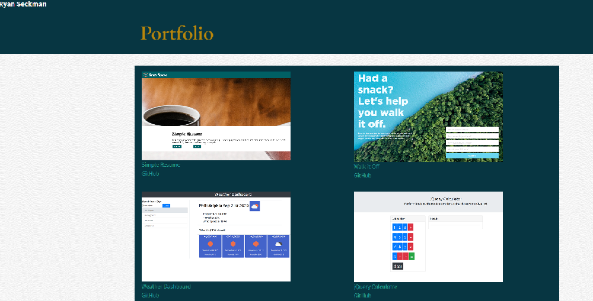

# Rseckman.github.io

## Deployed Site:
https://rseckman.github.io/

## Description
This is a web site to share about who I am and to spotlight some of the projects I have worked on.  This site is created with the intent to share with others what I can do, and potentially network for job opportunities and beyond.

The goal was to make a page that has a consistant navigation bar that could lead you to three pages: About, Portfolio and Contact.  All the links on the navigation bar must lead you correctly to the corresponding page.  

-The page must pass htlm validation without errors.
-Have a responsive layout
-Have responsive images
-use semantic html

I had free reign to choose my theme and design layout.

I used bootstraps grid and layout system to organize my items with rows and columns to make sure they were responsive to screen size changes.

## Questions?

  If you have any questions you can check out my github account: [Rseckman](https://github.com/Rseckman)
  or contact me at rseckman@hotmail.com
